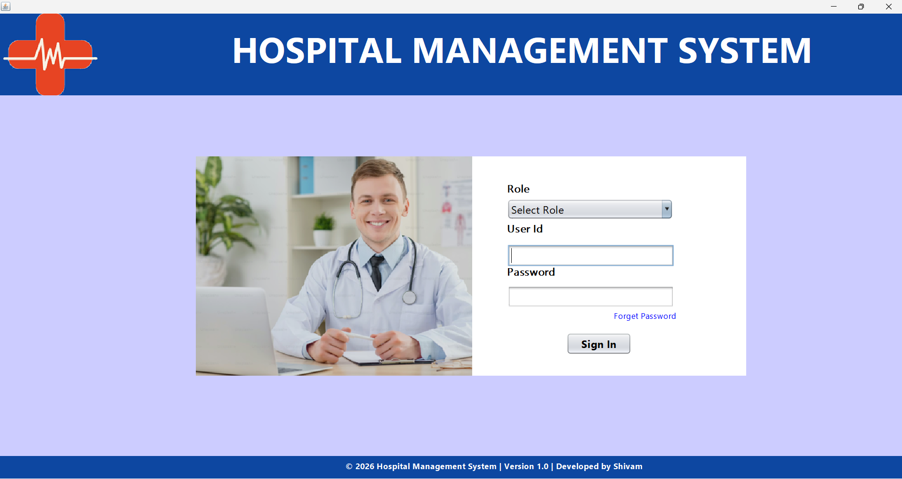
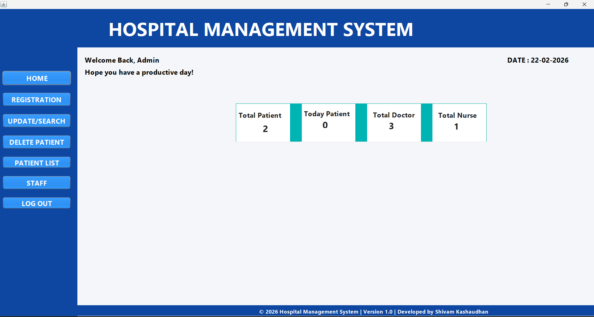
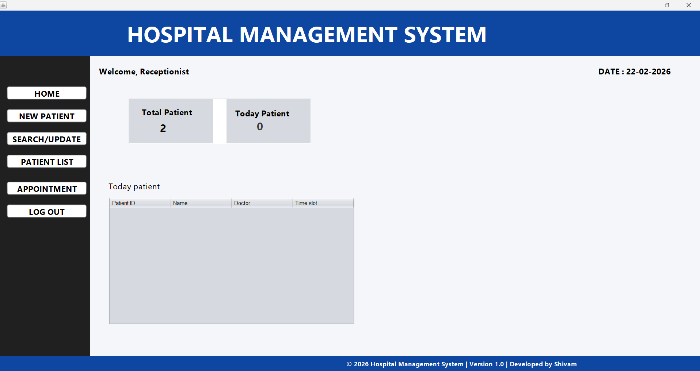
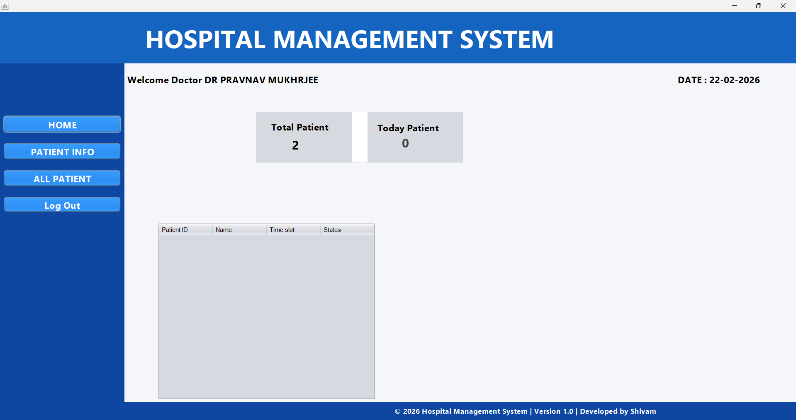

# 🏥 Hospital Management System (HMS)
A desktop-based **Hospital Management System** developed using **Java Swing and MySQL**.  
This system manages hospital operations including staff management, patient records, appointments, authentication, and role-based dashboards.

---
## 🚀 Features
- 🔐 Secure Role-Based Login (Admin / Doctor / Receptionist)
- 👨‍💼 Admin Dashboard with Statistics
- 👨‍⚕️ Doctor Dashboard
- 👩‍💻 Receptionist Panel
- 🧑 Patient Registration & Management
- 📅 Appointment Booking System
- 🔎 Search & Update Records
- 🗑 Delete Patient Records
- 🖼 Image Upload (BLOB storage in MySQL)
- 🔑 Forgot Password Functionality

---
## 📸 Screenshots

### 🔐 Login Page

### 👨‍💼 Admin Dashboard

### 👩‍💻 Receptionist Dashboard

### 👨‍⚕️ Doctor Dashboard

---
## 🛠 Technologies Used
- Java (Core + Swing)
- MySQL
- JDBC
- NetBeans IDE

---
## 🗄 Database Setup
**Database Name:** `hospitalmana`
### Steps:
1. Open MySQL
2. Import the SQL file: hms_database.sql
3. The SQL file will automatically:
- Create database `hospitalmana`
- Create required tables:
  - staff_registration
  - new_patient
  - appointment
   
---
▶️ How to Run
1. Clone the repository:
2. git clone https://github.com/shivam955582/Hospital-Management-System.git
3. Open the project in NetBeans
4. Configure MySQL credentials in the database connection file
5. Run the project
   
---
📂 Project Structure
- src/               → Java source files  
- screenshots/       → Project UI images  
- hms_database.sql   → Database schema  
- nbproject/         → NetBeans configuration  
- build.xml          → Build configuration

 ---
### 🔮 Future Improvements
- Email OTP for password reset 
- PDF Report Generation
- UI Modernization
- Spring Boot Web Version

---
### 👨‍💻 Author

 **Shivam Kashaudhan**       
🎓 BCA Student | 💻 Developer      
 GitHub: https://github.com/shivam955582 
